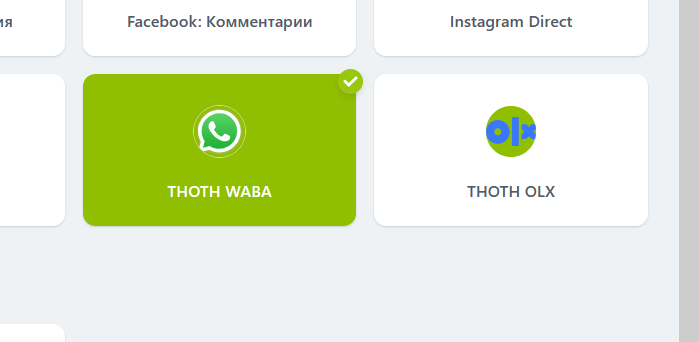

**## Connecting the Bitrix24 Portal**

Video tutorial (based on previous version) - https://youtu.be/ti99AeGAr4k

**#### Preparing the application on the separator server**

+ In the Sites section, rename example.com to the domain through which separator will be accessed
+ In Bitrix > Connectors section, add a connector with an SVG icon
+ Bitrix > Apps - add an app. Enter the name (waba, waweb, olx) and select a domain, choose the necessary connectors
+ For applications with connectors, add events to the events field one by one in the line
```
 ONAPPUNINSTALL
 ONIMCONNECTORMESSAGEADD
 ONIMCONNECTORLINEDELETE
 ONIMCONNECTORSTATUSDELETE
 ```
+ Fill in the "Page url" field with a link to the application settings page. For example (/waweb/, /waba/), this page will open in Bitrix24 when using web interface installation.

**#### Preparing the application in Bitrix24**
+ In Bitrix24, create a server local application (Applications – For Developers – Other – Local Application) in Bitrix24 and fill in the relevant fields (Your handler path and Initial installation path)
+ Required permissions (Permission setup): crm, imopenlines, contact_center, user, messageservice, im, imconnector, disk


**### Installing the application with a web interface**
After installation of this type, your application will appear in the left menu, and clicking it will open the page specified in "Page url"

In the local application's settings in Bitrix24, in addition to previous steps:

+ In the "Your handler path" field - https://example.com/app-settings/
+ In the "Initial installation path" field - https://example.com/app-install/
+ Fill in the "Menu item" field
+ Click "Install", then paste the obtained client_id and client_secret into the corresponding fields in the application on the separator server
+ In Bitrix24 local application, click the "Go to application" button, if everything is correct, you will see the page specified in the "Page url" field

**### Installing the application without a web interface**


+ In the "Your handler path" field -  https://example.com/api/bitrix/
+ In the "Initial installation path" field - https://example.com/api/bitrix/
+ Check the "Uses API only" checkbox
+ Click "Save", then paste the obtained client_id and client_secret into the relevant fields in the application on the separator server
+ After Click "Reinstall" button in b24 local app
+ In Bitrix in the "Contact Center" section, connectors should appear

