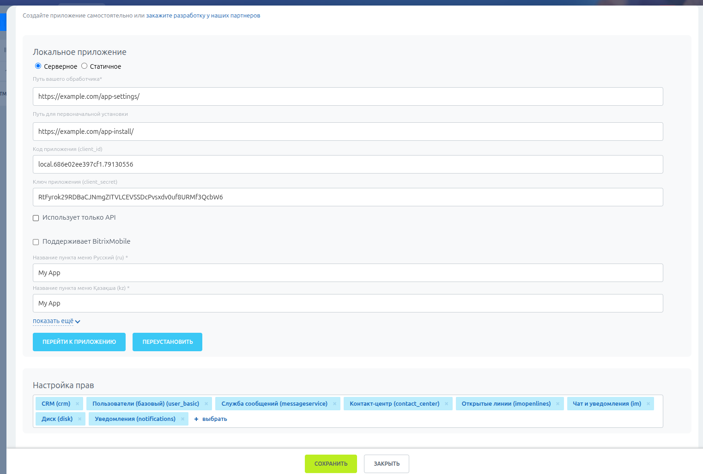
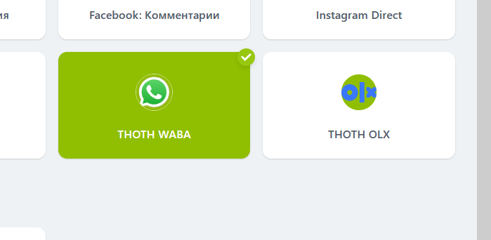

## Подключение портала Битрикс24

Видеоинструкция (сделана по предыдущей версии) - https://youtu.be/ti99AeGAr4k

#### Подготовка приложения на сервере separator

+ В разделе Sites переименуйте example.com в домен по которому будет доступен separator
+ В разделе Bitrix > Connectors добавьте коннектор с SVG иконкой
+ Bitrix > Apps - добавить приложение. Заполнить имя (waba, waweb, olx) и выбрать домен, выберите необходимые коннекторы
+ Для приложений с коннекторами добавить в поле events события по одному в строку
```
 ONAPPUNINSTALL
 ONIMCONNECTORMESSAGEADD
 ONIMCONNECTORLINEDELETE
 ONIMCONNECTORSTATUSDELETE
 ```
+ Заполните поле "Page url" ссылкой на страницу с настройками приложения. Например (/waweb/, /waba/, /olx/accounts/), эта страница будет открываться в Битрикс24 при использовании установки с вебинтерфейсом.

Так как приложение с вебинтерфейсом в Битрикс24 работает через Iframe, то для корректной работы в .env нужно добавить параметры (если без вебинтрефейса, то не нужно)

```
CSRF_COOKIE_SAMESITE=None
SESSION_COOKIE_SAMESITE=None
SESSION_COOKIE_SECURE=True
CSRF_COOKIE_SECURE=True
SESSION_COOKIE_NAME=__Secure-sessionid
CSRF_COOKIE_NAME=__Secure-csrftoken
```

#### Подготовка приложения в Битрикс24
+ В Битрикс24 создайте локальное приложение (Приложения – Разработчикам – Другое – Локальное приложение) в Битрикс24 и заполните соответствующие поля (Путь вашего обработчика и Путь для первоначальной установки) 
+ Необходимые права (Настройка прав): crm, imopenlines, contact_center, user, messageservice, im, imconnector, disk



### Устновка приложения с веб-интерфейсом 
После устаноки этого типа в меню слева отобразатся ваше приложение, а по клику будет открываться страница, заданная в "Page url"

Если в настройках приложения на сервере separator установить чекбокс "autologin", а локальному приложению в Битрикс24 будет выдано право user, то при открытии приложения на сервере separator будет автоматически создаваться и/или авторизовываться пользователь

В настройках локального приложения в Битрикс24 дополнительно к сделанным ранее:

+ В поле "Путь вашего обработчика" - https://example.com/app-settings/
+ В поле "Путь для первоначальной установки" - https://example.com/app-install/
+ Заполните поле "Пункт меню"
+ Нажмите "Установить", после чего полученные client_id и client_secret вставить в соответствующие поля приложения на сервере separator
+ После в локлаьном приложении в Битрикс24 нажмите кнопку "Перейти к приложению", если всё пройдет нормально, то вы увидете страницу, заданную в поле "Page url"

### Устновка приложения без веб-интерфейса


В настройках локального приложения в Битрикс24 дополнительно к правам:

+ В поле "Путь вашего обработчика" -  https://example.com/api/bitrix/
+ В поле "Путь для первоначальной установки" - https://example.com/api/bitrix/
+ Отметить чек-бокс "Использует только API"
+ Нажмите "Сохранить", после чего полученные client_id и client_secret вставить в соответствующие поля приложения на сервере separator и сохраните их там
+ Нажмите "Переустановить", после чего получите в Битриксе уведомление со ссылкой на привязку портала к вашей учетке в сепараторе (это можно сделать вручную в админке сепаратора)
+ В битриксе в разделе "контакт-центр" должны появиться коннекторы


