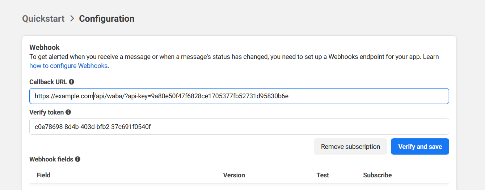

## Connecting WhatsApp (WABA)

Video tutorial: https://youtu.be/cSirpfq5rPQ  
+ It is recommended to obtain a [Permanent Token](https://developers.facebook.com/docs/whatsapp/business-management-api/get-started), otherwise you will need to regenerate the token every day.  
+ Create an app in the [Developer Portal](https://developers.facebook.com/apps/)  
+ In the app dashboard, enable the products: **Webhooks, WhatsApp**  
+ In the THOTH admin panel → **WABA → Add waba**  
  + **name** – the name of your application  
  + **Access token** – permanent or temporary token  
  + After saving, in the WABA list copy the **Verify token** for the desired account  

+ In the Developer Portal → **Quickstart > Configuration**  
  + **Callback URL** – `https://example.com/api/waba/?api-key=XXXXXXX`  
  + **Verify token** – the verify token from the previous step  


+ In the THOTH admin panel → **waba → phones**, add phone numbers:  
  + **Phone** – the phone number  
  + **Phone id** – the id from the Facebook app  
+ Select the previously created WABA object  
+ Select the **App instance** (Bitrix portal) to which the WABA number will be linked  
+ Check the **Sms service** checkbox if you want to register this number as an [SMS provider](messageservice.md)  
+ If everything is set up correctly, the connector in the Contact Center will turn green, and the line `THOTH_your_number` will be attached.  


## WABA Usage Notes

+ The most important rule – the first message per day can only be sent using a pre-approved template.  
  If a line (chat) already exists, you can send a template using the format:  
  `template-hello_world+en_US`, where `hello_world` is the template name, and `en_US` is the template language.  
  You can also send the first daily template message via [SMS](messageservice.md).  

# WhatsApp Cloud API SIP Trunk Activation (receiving calls on a telephony server, e.g. Asterisk)

https://developers.facebook.com/docs/whatsapp/cloud-api/calling  

+ After connecting the number, go to the settings (in the admin panel or user interface) and set both **"Calling"** and **"SIP"** to *Enabled*.  
+ Specify the address (e.g. `example.com`) of your server (TLS transport must be configured).  
+ TLS port: default is **5061**.  
+ Save the settings. If an error occurs during activation of incoming calls from Meta’s server, the error code will be displayed in the **Error** field.  
  Error codes explained here: https://developers.facebook.com/docs/whatsapp/cloud-api/calling/troubleshooting/  

### Example Asterisk (FreePBX) settings for receiving calls from WhatsApp Cloud API Calling

```
# pjsip.transports.conf
[0.0.0.0-tls]
type=transport
protocol=tls
bind=0.0.0.0:5061
external_media_address=123.123.123.123
external_signaling_address=123.123.123.123
ca_list_file=/etc/ssl/certs/ca-certificates.crt
cert_file=/etc/asterisk/keys/example.com-fullchain.crt
priv_key_file=/etc/asterisk/keys/example.com.key
method=tlsv1_2
verify_client=no
verify_server=no
allow_reload=no
tos=cs3
cos=3
local_net=10.8.0.0/24


# pjsip.conf
[wa.meta.vc]
type=aor
qualify_frequency=60
contact=sip:wa.meta.vc

[wa.meta.vc]
type=endpoint
transport=0.0.0.0-tls
context=from-meta
disallow=all
allow=opus
aors=wa.meta.vc
send_connected_line=no
rtp_keepalive=0
language=en
user_eq_phone=no
t38_udptl=no
t38_udptl_ec=none
fax_detect=no
trust_id_inbound=no
t38_udptl_nat=no
direct_media=no
media_encryption=sdes
rtp_symmetric=yes
dtmf_mode=auto

[wa.meta.vc]
type=identify
endpoint=wa.meta.vc
match=69.171.251.0/255.255.255.0
```